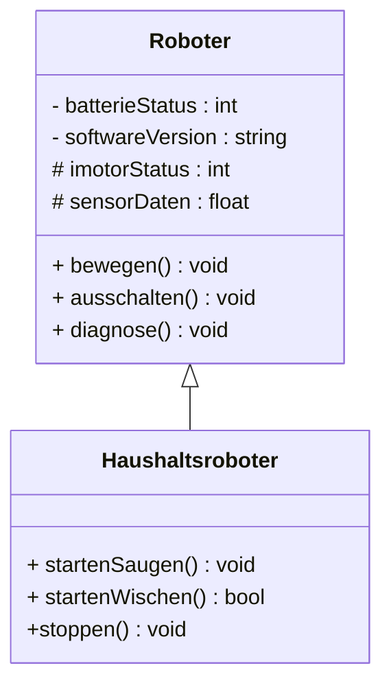

# 99-endabgabe-fizbuzz-smeerws

https://github.com/adam-p/markdown-here/wiki/Markdown-Cheatsheet
https://mermaid.live/
https://github.blog/2022-02-14-include-diagrams-markdown-files-mermaid/

```mermaid
classDiagram
    class Roboter {
        - batterieStatus : int
        - softwareVersion : string 
        # imotorStatus : int 
        # sensorDaten : float
        + bewegen() void
        + ausschalten() void
        + diagnose() void 
    }
    class Haushaltsroboter {
        + startenSaugen() void
        + startenWischen() bool
        +stoppen() void
    }
    Roboter <|-- Haushaltsroboter
```
